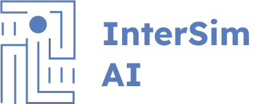

<h3 align="center">Product Based Capstone Project Bangkit 2024 | Batch 2</h3>

    

    InterSim is an AI-powered interview simulation platform designed to help fresh graduates prepare for job interviews. Recognizing that many new graduates feel underprepared, lack confidence, and often experience anxiety during interviews, InterSim provides a practical solution to improve communication skills and self-presentation in front of recruiters.

    Our development of InterSim leverages advanced technologies such as BERT to analyze the compatibility between candidates' skills and job descriptions, and LLaMA to generate relevant and adaptive interview questions. With its interactive and personalized simulations, InterSim offers a realistic interview experience, helping users practice their responses with increased fluency and confidence. This platform is particularly beneficial for job seekers, especially fresh graduates, as it enhances their chances of success in the recruitment process.

    We believe InterSim can help job seekers build confidence and better prepare for interviews by offering an experience that closely resembles a real interview. This approach is expected to reduce interview anxiety and improve users' communication skills when interacting with recruiters.

## Our Team Members

<pre>
Team ID         : C242-PS303
Project Manager : Danang Hapis Fadillah - M211B4KY0976
</pre>

| Name                                                                                      | Bangkit ID   | Learning Path      | GitHub                                                                                  |
| ----------------------------------------------------------------------------------------- | ------------ | ------------------ | --------------------------------------------------------------------------------------- |
| [Danang Hapis Fadillah](https://www.linkedin.com/in/danang-hapis-fadillah-682878202/)     | M211B4KY0976 | Machine Learning   |  |
| [Muhammad Rahmat Dhany](https://www.linkedin.com/in/dhanymuhammad08/)                     | M211B4KY3009 | Machine Learning   |              |
| [Azis Marwadin](https://www.linkedin.com/in/azis-marwadin-5189442a0/)                     | M211B4KY0765 | Machine Learning   |              |
| [Muhammad Fatih Azhar]()                                                                  | C211B4KY2838 | Cloud Computing    |              |
| [Arien Alen Sucahyo](https://www.linkedin.com/in/arien-alen-58b482330/)                   | C211B4KX0635 | Cloud Computing    |              |
| [Muhammad Rafli Octavian](https://www.linkedin.com/in/muhammad-rafli-octavian-8b3055231/) | A211B4KY3006 | Mobile Development | |
| [Akmal Muhammad Rasyad](https://www.linkedin.com/in/akmalmrasyad/)                        | A211B4KY0300 | Mobile Development |              |
